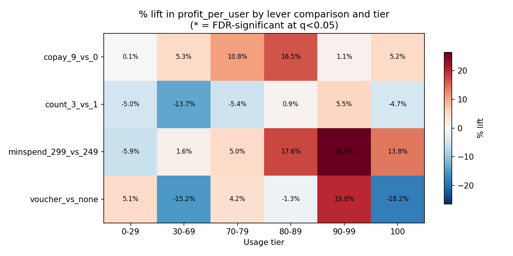
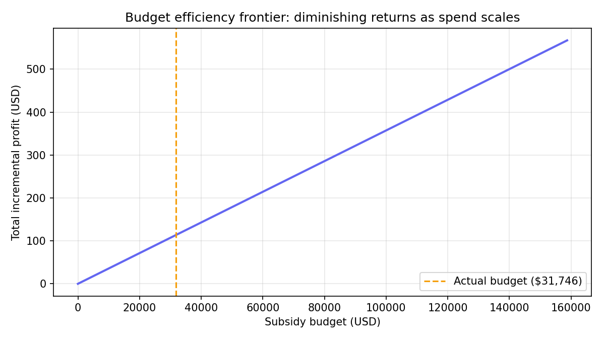

# 🎟️ Voucher Targeting & Growth Experimentation

### Which buyers should get which free-shipping voucher — and how much should we spend finding out?

[](https://python.org) [](./LICENSE) [](./) [](./)

---

## TL;DR

Across 6 buyer segments and 6 voucher configurations (shipping copay × min-spend × voucher count), the highest **profit-per-budget-dollar** segment isn't the one with the biggest per-user lift — it's `70-79%` historical-usage buyers on a cheap, low-frequency voucher (`$19 copay, 1 voucher`). Under the case's original NT$1,000,000 subsidy cap, a budget-ranked allocation across *all* segments outperforms any single-segment strategy on blended ROI. But the underlying experiment, as sized, is **underpowered** to detect several of the effects it's built to find — that finding is as important as the allocation itself.



---

## Overview

This project simulates a factorial A/B test evaluating free-shipping **voucher design** (shipping copay, minimum-spend threshold, voucher count) against buyer segments defined by historical voucher usage rate, then uses the results to answer a budget-allocation question: *given a fixed subsidy budget, which segment × voucher combinations should get funded first?*

It's built on a real prior work project (see `Background`), reconstructed as a **calibrated simulation** — individual-level data doesn't exist in the source material (only segment-level aggregate tables), so an explicit, validated data-generating process (DGP) reproduces those aggregates and lets the analysis go one level deeper: significance testing, uplift modeling, and budget optimization that the original aggregate-only tables couldn't support.

**Data**: Calibrated simulation, anchored to 7 real test conditions × 6 usage-tier aggregates transcribed from the source case study. See `Calibration & Validation` below — this project treats "does the simulation actually reproduce the known numbers" as a first-class deliverable, not an afterthought.

---

## Background

Historical free-shipping voucher usage splits buyers into 6 tiers (100%, 90–99%, 80–89%, 70–79%, 30–69%, 0–29%), reflecting how habitually a buyer relies on free shipping to complete a purchase. The original work tested 7 voucher configurations — varying **shipping copay** ($0/$9/$19), **minimum spend** ($199/$249/$299), and **voucher count** (1 or 3) — against these tiers, with a fixed **NT$1,000,000** subsidy budget to allocate across whichever segments looked most efficient.

**Why simulation, not the original data**: only segment-level aggregate tables survive (order/user and profit/user by tier × condition) — no individual-level rows. Calibrated parameters (tier population shares, baseline conversion, lever effect sizes) are transcribed directly from those tables; everything below the aggregate level (individual variation, significance tests, uplift models) is a validated reconstruction, disclosed as such throughout.

---

## Experiment Design

```
6 usage tiers x 7 tested voucher conditions (within-tier random assignment):

  ┌──────────────────────────────────────────────────────────────┐
  │  Tier        Pop. share   Baseline order/user (no voucher)   │
  │  100%          19.6%              0.031                      │
  │  90-99%         3.7%              0.097                      │
  │  80-89%         7.9%              0.091                      │
  │  70-79%         8.6%              0.089                      │
  │  30-69%        18.4%              0.095                      │
  │  0-29%         41.7%              0.082                      │
  └──────────────────────────────────────────────────────────────┘

Voucher conditions tested (copay / min-spend / count):
  no_voucher | $0/$199/×1 | $0/$249/×3 | $0/$299/×3
  $9/$249/×3 | $19/$199/×1 | $19/$199/×3

Primary outcome:   order_per_user  (conversion within test window)
Secondary outcome: profit_per_user (net of shipping subsidy cost)
Guardrail:         gross subsidy cost per user (drives the budget constraint)
```

---

## Metrics Framework

| Layer | Metric | Why |
|---|---|---|
| **North Star** | Net incremental profit per subsidy dollar spent (ROI) | Ties every voucher decision to the actual finance constraint — a fixed subsidy budget, not unlimited spend |
| **Input / Driver** | order_per_user, profit_per_user, redemption rate — by tier × voucher config | The levers the experiment directly manipulates |
| **Guardrail** | Gross subsidy cost per user; statistical power per comparison | Prevents two failure modes: overspending on segments that don't move, and making budget calls off underpowered point estimates |

---

## Calibration & Validation

Unlike a typical simulated portfolio project, this one treats "did the simulation come out right" as a visible, reported step — including two bugs the validation process actually caught and fixed:

| Check | Found | Fix |
|---|---|---|
| Aggregation recovery vs. transcribed source tables | Continuous cross-tier interpolation smeared a real discontinuity (the "100%" tier is a different population than "90-99%", likely one-time buyers) into neighboring tiers — up to 38% error | Switched to exact discrete per-tier lookup |
| Anchor-point consistency | "No voucher issued" and "voucher issued at $0 copay" were incorrectly treated as the same baseline — issuing a voucher at all carries its own level shift | Re-anchored the additive model at the observed $0-copay/$249-min-spend/×3 cell |
| Post-fix aggregation recovery | — | 41/42 order cells, 36/42 profit cells within ±15% of the transcribed targets |
| Sampling-noise sanity check | Repeated small-N draws jitter consistent with binomial standard error (not suspiciously exact) | — |
| Placebo check | Shuffled treatment labels collapse the apparent effect | — |

Residual misses concentrate in the `90-99%` tier under stacked copay+count extrapolation — most likely a real copay×count interaction the additive model can't capture, which the case's own narrative supports (it explicitly calls out that the count effect "concentrates" in this tier). Documented, not hidden, in `DGP_ASSUMPTIONS.md`.

---

## Methods

| File | Method | Question | Key Output |
|---|---|---|---|
| `build_calibration_targets.py` | Transcription | What does the source data actually say? | `case_summary_tables.csv` |
| `data_generation.py` | Calibrated DGP | Individual-level reconstruction anchored to segment aggregates | `experiment_log.csv` |
| `validation.py` | Aggregation recovery, noise check, placebo | Did the simulation come out right? | Pass/fail table per cell |
| `experiment_analysis.py` | FDR-corrected significance tests + interaction regression | Which levers work in which tiers, and are we sure? | Named comparisons, power analysis |
| `uplift_model.py` | T-learner vs. grouped-means baseline | Is there real heterogeneity beyond the tier label? | Targeting priority table |
| `budget_allocator.py` | Greedy fractional knapsack | Given a fixed budget, what's the optimal allocation? | Allocation + ROI vs. 3 benchmark strategies |

---

## Key Findings

### 1. None of the 4 headline comparisons survive multiple-comparison correction at current sample size

Every named comparison (voucher vs. none, min-spend threshold, copay, voucher count) trends in the direction the source case reports — but after FDR correction across 24 tests, **0 are significant**. A power analysis pins down why: the `90-99%` tier's observed 29.6% order-rate lift would need ~4,000 users per arm to detect at 80% power after correction; the simulated cell has ~1,060, with a minimum detectable effect of ~60% — double the observed lift. Rerunning the same DGP at the prescribed N=750k recovers **7/48 significant**, exactly in the large-true-effect cells, while negligible-true-effect cells correctly stay null — closing the loop on the diagnosis. **This is the headline finding, not a footnote**: any real follow-up test needs a proper power calculation (and ideally stratified oversampling of the small high-value tiers) before launch, not just a plausible-looking sample size. Notebook 02 runs the full readout in platform order: SRM trust check first, then CIs, direction-concordance against ground truth, and a per-cell power/MDE table.

### 2. A flexible uplift model doesn't earn its complexity here

A RandomForest T-learner (tier + usage_rate) still attributed 45% of predicted treatment-effect variance to "within-tier" differences even after regularization — but the DGP's true effect is tier-only, so that 45% is model noise, not discovered heterogeneity. A simple grouped-means baseline (0% within-tier variance, by construction) is the better targeting model until richer individual covariates (device, channel, browsing history) are available.

### 3. Under a hard budget cap, the best segment isn't the one with the biggest per-user lift

`90-99%` tier buyers show the largest incremental profit per user among generous vouchers — but those vouchers are expensive to run. `70-79%` tier buyers on a cheap voucher (`$19 copay, ×1`) deliver worse per-user lift but far better profit-per-dollar-spent, which is what matters when the constraint is a fixed subsidy pool, not unlimited spend.

### 4. The original case's 3 named strategies solve a different objective than "maximize ROI under a budget cap"

Re-evaluated at the same NT$1,000,000 budget, Scenario 1 (order-volume-max) barely breaks even, Scenario 2 (profit-per-user-max) is net-negative once its full gross subsidy cost is counted, and Scenario 3 (blended) is also negative. This isn't "the original analysis was wrong" — those scenarios were designed to maximize order volume or per-user profit in isolation, not cost-efficiency under a hard cap. **The right takeaway is that stating the objective function precisely changes the recommended answer**, which is itself a Product Scientist judgment call, not just a modeling one.

---

## Decision Memo

**Recommendation**: allocate the full NT$1,000,000 (~$31,746 USD) budget to `70-79%`-tier buyers on the `$19-copay / ×1-voucher` configuration, reaching ~12,000 users at ~100% budget utilization.

| Strategy | Incremental profit | Cost | Blended ROI | Users reached |
|---|---|---|---|---|
| Original Strategy 1 (order-volume max, 90-99% tier) | $4 | $31,746 | 0.0% | 2,081 |
| Original Strategy 2 (profit-per-user max, 30-69% tier) | **-$26** | $31,745 | -0.1% | 2,962 |
| Original Strategy 3 (60/40 blended) | -$8 | $31,728 | -0.0% | 2,432 |
| **This project's ROI-ranked allocation** | **$113** | $31,746 | **0.4%** | 12,025 |

Caveats that matter more than the headline number:
- `shipping_base_cost` (45), `TOTAL_ADDRESSABLE_USERS` (9M accounts), and per-order unit economics (450 AOV × 5% commission − 15 variable shipping cost) are **provided operational figures** from the original logistics context; only the TWD/USD rate (31.5) remains an assumption, needed because the source tables label profit in USD while the budget is NTD. A 27-combination sensitivity sweep (see `outputs/sensitivity_analysis.csv`) shows the **recommended segment is robust across all combinations tested** — `70-79%`/`$19-copay ×1` wins in every one, though ROI ranges 0.26–0.58% depending on the cost basis. Robust choice, modest and uncertain magnitude.
- The unit economics also enable an independent cross-check: calibrated baseline profit-per-order declines monotonically from 1.08× the 52.5-NTD no-voucher ceiling (0-29% tier) to 0.35× (90-99% tier), exactly the ordering the P&L structure predicts — see `DGP_ASSUMPTIONS.md`.
- The recommended segment (`70-79%`) is also one of the smaller, noisier tiers from the power analysis (Finding #1) — before committing real budget, this allocation should be validated with a properly-powered live test, not launched off this point estimate alone.



---

## Repository Structure

```
VoucherABTest/
├── data/
│   ├── raw_benchmarks/
│   │   └── case_summary_tables.csv
│   └── processed/
│       └── experiment_log.csv
├── notebooks/
│   ├── 00_calibration_targets.ipynb
│   ├── 01_data_generation_and_validation.ipynb
│   ├── 02_experiment_analysis.ipynb
│   ├── 03_uplift_segmentation.ipynb
│   └── 04_budget_optimization.ipynb
├── outputs/
│   ├── figures/
│   │   ├── tier_lever_heatmap.png
│   │   └── budget_efficiency_frontier.png
│   ├── named_comparisons.csv
│   ├── power_mde_table.csv
│   ├── targeting_priority.csv
│   └── sensitivity_analysis.csv
├── build_calibration_targets.py
├── data_generation.py
├── validation.py
├── experiment_analysis.py
├── uplift_model.py
├── budget_allocator.py
├── visualization.py
├── DGP_ASSUMPTIONS.md
├── LICENSE
├── requirements.txt
└── README.md
```

Notebooks are jupytext percent-format underneath (`.py` source files alongside each `.ipynb` for clean diffs) and import directly from the top-level `.py` modules — they're thin, narrated wrappers around the same code the modules expose, not a separate implementation.

## Setup

```bash
pip install -r requirements.txt

python build_calibration_targets.py   # transcribe source tables
python data_generation.py             # generate calibrated individual-level data
python validation.py                  # confirm the simulation reproduces known numbers
python experiment_analysis.py         # significance tests + power analysis
python uplift_model.py                # T-learner vs. grouped-means baseline
python budget_allocator.py            # budget-constrained allocation
```

---

## Limitations

- **Source data is aggregate-only.** Every individual-level number in this project is a reconstruction calibrated to match reported segment aggregates — real individual-level data doesn't exist here, and the original case study itself is explicitly disclaimed as an anonymized/synthesized illustrative case.
- **Additive lever model.** Copay, min-spend, and voucher-count effects are combined additively; the one clear sign of a real interaction (copay×count in the `90-99%` tier) isn't modeled, by necessity of data sparsity.
- **Underpowered as sized.** See Finding #1 — this is a simulation of what the experiment *would* look like at a specific (assumed) sample size, not a claim that the effects aren't real at the scale the original case actually ran at.
- **FX rate is the one remaining assumption.** Shipping cost basis (45), addressable population (9M accounts), and per-order unit economics are provided operational figures; the TWD/USD rate (31.5) remains assumed, needed only because the source tables label profit in USD while the budget is NTD. The sensitivity sweep shows the recommended allocation is robust to it.

---

## About

Built as a portfolio project demonstrating applied experimentation, uplift modeling, and budget-constrained decision-making for Product Data Scientist / Experimentation Scientist roles.

**Methods**: Factorial A/B design · FDR-corrected significance testing · Power analysis · T-learner uplift modeling · Greedy fractional-knapsack budget optimization
**Tools**: Python · pandas · scikit-learn · statsmodels · scipy
**Source case**: Reconstructed from a prior work project (voucher ROI segmentation, e-commerce logistics), itself explicitly disclaimed by its author as anonymized/synthesized for portfolio use.
