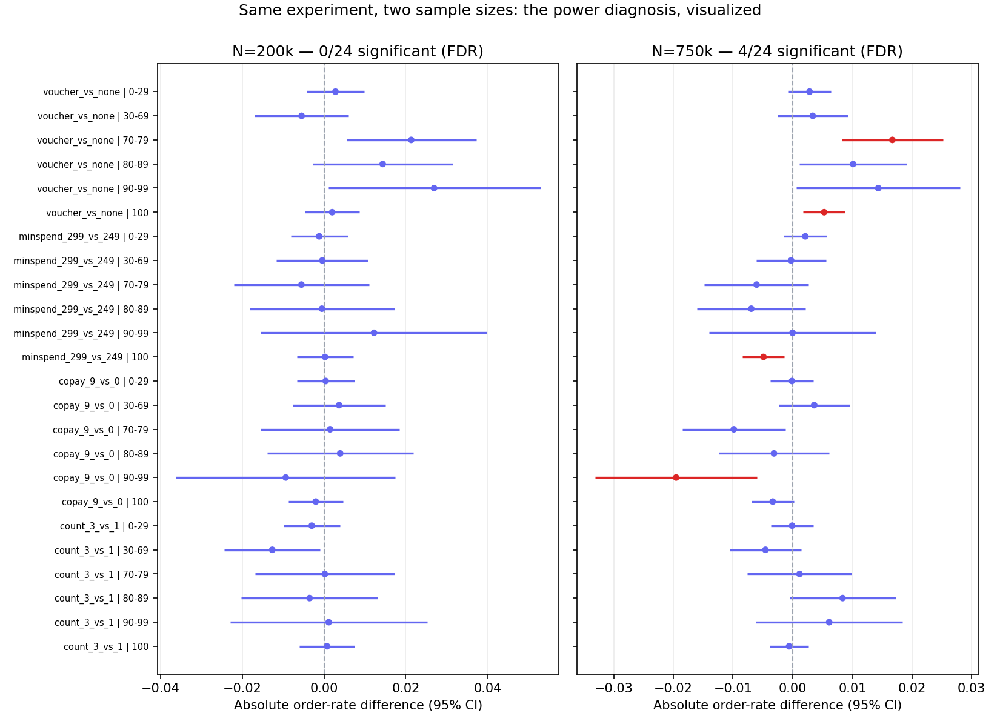
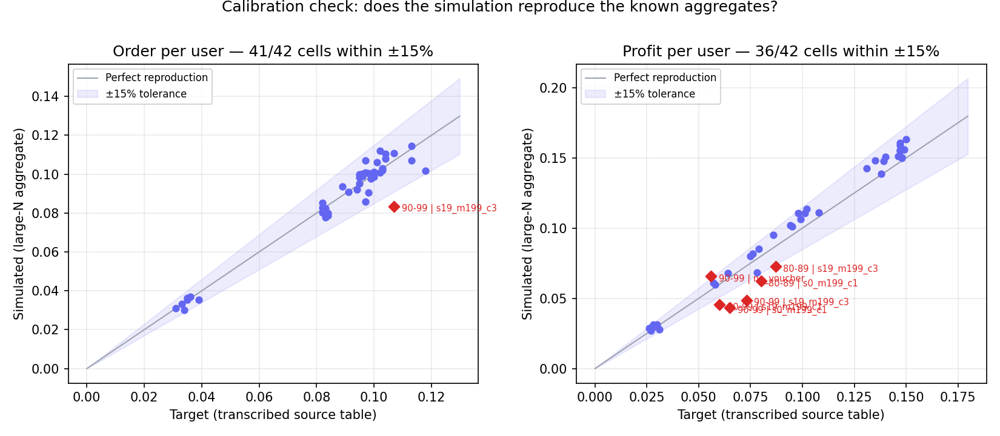

# 🎟️ Should We Launch This Voucher Strategy?

### A Product Data Science take-home: free-shipping voucher targeting for an e-commerce marketplace

[](https://python.org) [](./LICENSE) [](./) [](./)

---

## Verdict (TL;DR)

**Don't launch broadly. Run one more experiment, then roll out narrowly.**

The voucher program as a whole does move orders — **+0.36 pp (95% CI [+0.03, +0.70]), a +4.8% relative lift, p = 0.03** (population-weighted, any voucher vs. control). But the launch decision needs more than that: all three originally proposed strategies are flat-to-negative ROI once gross subsidy cost is counted against a hard NT$1,000,000 budget cap, and the *design* questions — which configuration, for whom — are unconfirmable at this sample size (0/48 per-cell comparisons survive FDR correction, with a minimum detectable effect roughly **double** the largest observed lift). The one configuration that is robustly cost-efficient across every sensitivity scenario (`70-79%` usage-tier buyers, `$19-copay ×1` voucher) is worth a **properly-powered targeted pilot**, not a full launch.


---

## 1. Product Background

Shopee-like marketplaces subsidize shipping to drive orders, but free-shipping vouchers are a major marketing cost line, and heavy voucher users may be buyers who would have purchased anyway (deadweight loss). The business wants to **increase orders while minimizing voucher cost** — and Finance has capped the quarterly subsidy pool at **NT$1,000,000**.

The decision question this analysis answers:

> **Given a fixed subsidy budget, should the company launch this voucher program — and if so, for whom, with which voucher design?**

Buyers are segmented by historical free-shipping usage rate (what share of their past orders used free shipping) into 6 tiers — a purchase-behavior segmentation that separates habitual voucher users from self-paid buyers. Seven voucher configurations were tested, varying three levers: **buyer copay** ($0/$9/$19 out-of-pocket shipping), **minimum spend** ($199/$249/$299), and **voucher count** (1 or 3 per user).

**Data note**: only segment-level aggregate tables survive from the original test (order/user and profit/user by tier × condition). This project reconstructs individual-level data as a **calibrated, validated simulation** anchored to those aggregates plus real unit economics (450 AOV × 5% commission − $15 variable shipping cost, $45 shipping fee, 9M addressable accounts) — see [Calibration & Validation](#8-calibration--validation-why-the-numbers-can-be-trusted).

---

## 2. Product Metrics

The metric tree below shows how the North Star decomposes into the levers the experiment manipulates — and the built-in tension: **copay pushes the primary and the secondary in opposite directions** (raising copay collects more revenue per order but suppresses ordering), which is exactly why this needs an experiment rather than a spreadsheet.

```
Net incremental profit per subsidy $        ← NORTH STAR
│
├── Δ Orders per user                        ← PRIMARY
│     ↑ pushed up by generosity: copay↓, count↑, min-spend↓
│
├── × Profit per order                       ← SECONDARY
│     ├── + copay collected from buyer       (↑ with copay — the tension)
│     ├── + commission (450 AOV × 5%)
│     └── − variable shipping cost (15)
│     (GMV/user = orders × 450 AOV moves proportionally with the primary)
│
└── ÷ Gross voucher cost per user            ← GUARDRAIL (budget-binding)
      = order rate × count × (45 − copay)
```

| Layer | Metric | Definition | Why it's here |
|---|---|---|---|
| **North Star** | Net incremental profit per subsidy dollar (ROI) | (Δprofit vs. control) / gross voucher cost | Ties every decision to the actual constraint — a capped subsidy pool, not unlimited spend |
| **Primary** | Orders per user | Order rate within the test window | The behavior the voucher is designed to move; powers the launch decision |
| **Secondary** | Profit per user | Net of subsidy, per the unit-economics P&L | Catches "we bought orders at a loss"; GMV/user (= orders × 450 AOV) moves proportionally |
| **Guardrail** | Gross voucher cost per user | order rate × count × (45 − copay) | Budget-cap compliance — the binding constraint |
| **Guardrail** | Deadweight share | Redemptions by users who would have ordered anyway | The core economic risk of subsidizing habitual users |
| **Guardrail** (launch-only) | Cancellation rate, merchant complaints, repeat-purchase cannibalization | Not observable in this reconstruction | Required instrumentation for the real rollout — listed so the launch plan measures them from day one |

---

## 3. Experiment Design

**Eligibility.** Included: active buyer accounts with ≥1 order in the past 12 months (required to compute a historical usage rate). Excluded: newly registered accounts with no order history (can't be tiered — they belong in a separate new-user onboarding experiment), business/wholesale accounts, and accounts already enrolled in any concurrent voucher experiment (to prevent cross-treatment contamination).

**Randomization unit: buyer account** — not session, not order. Vouchers are account-level assets; session-level assignment would let the same person land in multiple arms and self-contaminate. **Exposure = assignment**: the voucher is deposited directly into the account at randomization, so there is no trigger-dilution gap between assigned and treated.

```
                    9,000,000 buyer accounts
                             │
              segment by historical free-shipping
                    usage rate (6 tiers)
   ┌──────┬──────┬───────────┬───────┬────────┬────────┐
  100%  90-99%  80-89%     70-79%  30-69%   0-29%
 (19.6%) (3.7%) (7.9%)     (8.6%) (18.4%)  (41.7%)
                             │
            stratified randomization WITHIN tier
                     (1/7 to each arm)
                             │
        ┌────────────────────┴────────────────────┐
        ▼                                         ▼
   CONTROL                              6 TREATMENT ARMS
  no voucher                    copay {$0,$9,$19} × min-spend
                               {$199,$249,$299} × count {1,3}
        │                                         │
        └────────────────────┬────────────────────┘
                             ▼
        OUTCOMES: order rate (primary), profit/user
                             ▼
   ANALYSIS: SRM trust check → 2-proportion z-test (orders)
     + Welch t-test (profit) → BH-FDR correction → power/MDE
```

Noise controls in the original design: commercial spike campaigns and weekends excluded; logistics peak-congestion periods avoided.

---

## 4. Sample Size & Power

Parameters: **power = 80%, α = 0.05** (Bonferroni-corrected to 0.00208 across 24 order-rate comparisons — the honest question is what's detectable *after* correction, not before).

| Quantity | Value |
|---|---|
| Largest observed effect | +29.6% order-rate lift (voucher vs. none, 90-99% tier) |
| Current n per arm in that cell | ~1,060 |
| **Minimum Detectable Effect (MDE)** at that n | **~60% lift — double the observed effect** |
| **Required n per arm** to detect the observed lift | **~4,000** |
| Implied total (naive scale-up: the 90-99% tier is only 3.7% of buyers) | **~750,000 users** |
| Smarter design | Stratified oversampling of small high-value tiers → similar power at roughly half the total |

Full per-cell table in `outputs/power_mde_table.csv` (all 24 order-rate cells are underpowered at N=200k). To close the loop, the same DGP rerun at the prescribed N=750k recovers **7/48 significant** — exactly in the large-true-effect cells, while negligible-effect cells correctly stay null:



Paired evidence files: `outputs/named_comparisons.csv` (N=200k, 0/48) vs. `outputs/named_comparisons_powered_750k.csv` (N=750k, 7/48).

---

## 5. Trust Check: Sample Ratio Mismatch (SRM)

Before reading any result: did randomization deliver the designed 1/7 split within every tier? Chi-square goodness-of-fit per tier, with the industry-standard strict alarm threshold (p < 0.001, because at large N a 0.05 threshold false-alarms on trivial imbalances):

| Check | Result |
|---|---|
| All 6 tiers, observed vs. designed 1/7 allocation | **Pass** — p-values range 0.19–0.81, no tier near the alarm threshold |

Notebook 02 enforces this as a hard `assert` — the analysis refuses to proceed on a failed SRM, because a broken assignment mechanism invalidates every downstream number regardless of how significant it looks. Two further trust checks live in notebook 01: a **placebo test** (shuffled treatment labels collapse the apparent effect, ruling out leakage in the pipeline) and a **sampling-noise check** (repeated small-N draws jitter in line with the theoretical binomial SE — the data is realistically noisy, not suspiciously exact).

---

## 6. Results: Primary Estimate & Average Effects

**Primary readout (population-weighted, any voucher vs. control):**

> Vouchers lift order rate by **+0.36 pp (95% CI [+0.03, +0.70])** — a **+4.8% relative lift** on a 7.6% control base, p = 0.032.

The program-level effect is significant even at N=200k: pooling all six treatment arms and weighting across tiers concentrates enough power for the coarse question. The launch-relevant tension is that the *design* questions — which lever, for whom — fragment that same power across 48 cells, and **none survives FDR correction** (Section 4). So the honest state of the evidence is: **the program works; we cannot yet say which version for whom.** Two further findings survive because they don't depend on any single cell:

- **The three originally proposed strategies are flat-to-negative under the budget cap.** Re-evaluated at the same NT$1,000,000 with gross subsidy cost counted: order-volume-max ≈ $4 incremental profit, profit-per-user-max ≈ −$26, the 60/40 blend ≈ −$8. These strategies optimized order volume or per-user profit in isolation — stating the objective function precisely (profit per budget dollar) changes the answer.
- **A budget-ranked allocation beats all three** ($113 incremental profit, 12,025 users reached at full budget utilization) by funding the cost-efficient segment first rather than the highest-lift segment.


---

## 7. Heterogeneous Effects

**Governance first.** The usage-rate tier is the **pre-registered** heterogeneity dimension — it comes from the original experiment's design, not from post-hoc slicing — and its per-cell results are BH-FDR corrected. Any cut *not* pre-specified (tenure, region, merchant category, device) is exploratory by rule: it can generate hypotheses for the next experiment but cannot support this launch decision. The cost of skipping this discipline is demonstrated inside the project itself: an RF uplift model confidently attributed 45% of effect variance to within-tier differences that the ground truth says do not exist (notebook 03) — exactly the kind of "discovered segment" an ungoverned HTE analysis would have shipped.

Segment-level heterogeneity is the product story here — the average treatment effect is nearly meaningless when segments respond this differently:

| Segment (by purchase/voucher frequency) | Effect pattern | Product interpretation |
|---|---|---|
| **90-99% usage** (high-frequency voucher users, 3.7% of buyers) | Largest order-rate lift (+29.6% observed); only tier where voucher count (#1→#3) helps | Most responsive — but expensive to serve and the noisiest estimate (smallest tier) |
| **100% usage** (19.6%) | Low baseline, weak response; profit/order far below the unit-economics ceiling | Likely one-time buyers whose every order used free shipping — a different population, not the top of a continuum; poor voucher target |
| **70-79% usage** (8.6%) | Moderate lift, but **best profit per subsidy dollar** on a cheap voucher ($19 copay, ×1) | **The recommended pilot segment** — wins in all 27 sensitivity scenarios |
| **30-69% usage** (18.4%) | Negative profit signals under multi-voucher configs | Deadweight-loss risk zone; do not target with generous vouchers |
| **0-29% usage** (self-paid buyers, 41.7%) | Effects negligible across all levers | Correctly null — vouchers don't move buyers who ignore shipping fees; any spend here is waste |

Two disciplined non-findings, verified against simulation ground truth:
- **No heterogeneity beyond the tier label**: an RF T-learner attributed 45% of effect variance to within-tier differences, but the ground truth has none — that 45% is model noise, and a grouped-means model is the right targeting tool until richer covariates exist (notebook 03).
- **Sign agreement with ground truth is only 70%** among non-negligible effects at N=200k — a concrete warning against reading individual cell directions at this sample size (notebook 02).

**Cuts not available in the source data** — new vs. tenured users, region, merchant category, device — are specified in the pilot's instrumentation plan (Section 8) rather than fabricated here.

---

## 8. Recommendation

**Decision: Don't launch. Run one targeted, properly-powered experiment. Then roll out narrowly.**

| Option | Call | Reasoning |
|---|---|---|
| Launch all users / any original strategy | ❌ **No** | Flat-to-negative ROI under the budget cap; effects unconfirmed at current power |
| Launch the optimized allocation now | ❌ **Not yet** | The winning segment (70-79%) is one of the noisiest cells; committing budget on an unconfirmable point estimate is exactly the mistake the power analysis exposes |
| **Run a follow-up experiment** | ✅ **Yes — this quarter** | 2-arm design (control vs. $19-copay ×1) on the 70-79% tier only: needs ~4,000/arm ≈ 8,000 users, trivially affordable against 9M accounts; add the launch guardrails (cancellation, merchant complaints, repeat-purchase at 30/60 days) and the missing HTE cuts (tenure, region, merchant category) to instrumentation |
| If the pilot confirms | ➡️ **Staged rollout to the 70-79% tier (~774k buyers), 20% → 100%**, with a permanent 5-10% holdout to measure long-run deadweight and cannibalization | The config is robust across all 27 sensitivity combinations of shipping cost, population, and FX — the uncertainty is statistical, not structural |

Why this is the right call even though "one more experiment" feels slow: the budget-ranked allocation only projects ~$113 incremental profit per NT$1M — the modest magnitude means the cost of a wrong launch (burning quarterly budget + merchant friction) exceeds the cost of a 2-week confirmation test by an order of magnitude.

---

## 9. Limitations

**Experimental-validity threats a real launch must handle (not modeled here):**
- **Interference / network effects**: voucher availability can shift marketplace-wide behavior (sellers adjusting prices, buyers consolidating carts), violating the no-interference assumption between arms.
- **Coupon leakage**: vouchers shared, stacked, or farmed outside the assigned cohort contaminate the control group and inflate costs.
- **Novelty effect**: early-window lifts often decay; a 2-week readout overstates steady-state impact — the pilot's repeat-purchase guardrails at 30/60 days address this.
- **Seasonality**: the original test excluded spike campaigns and weekends — effects during Double-11-type peaks may differ materially.
- **Cancellation & returns**: orders driven by discounts cancel at higher rates; unmeasured here, instrumented in the pilot.

**Reconstruction-specific limitations:**
- Source data is aggregate-only; all individual-level structure is a validated simulation, and the original case study is itself disclaimed as anonymized/synthesized.
- Lever effects are combined additively; the one visible sign of a real copay×count interaction (90-99% tier residuals) isn't modeled.
- The TWD/USD rate (31.5) is the single remaining assumed parameter; shipping cost (45), population (9M), and unit economics are provided operational figures.

---

## 10. Calibration & Validation (why the numbers can be trusted)

This project treats "did the simulation come out right" as a first-class deliverable — including two bugs the validation process caught and fixed:

| Check | Found | Fix |
|---|---|---|
| Aggregation recovery vs. transcribed source tables | Continuous cross-tier interpolation smeared a real discontinuity (the "100%" tier is a different population than "90-99%") into neighboring tiers — up to 38% error | Switched to exact discrete per-tier lookup |
| Anchor-point consistency | "No voucher issued" and "voucher at $0 copay" were conflated — issuing a voucher at all carries its own level shift | Re-anchored the additive model at the observed $0/$249/×3 cell |
| Post-fix recovery | — | **41/42 order cells, 36/42 profit cells within ±15%** of targets |
| Unit-economics cross-check | — | Calibrated profit/order declines monotonically from 1.08× the 52.5-NTD no-voucher ceiling (0-29% tier) to 0.35× (90-99%) — exactly the ordering the P&L predicts |
| Sampling-noise + placebo checks | — | Jitter consistent with binomial SE; shuffled labels collapse the effect |



Every parameter's provenance (transcribed / derived / assumed) is documented in [`DGP_ASSUMPTIONS.md`](./DGP_ASSUMPTIONS.md).

---

## Repository Structure

```
VoucherABTest/
├── data/
│   ├── raw_benchmarks/
│   │   └── case_summary_tables.csv
│   └── processed/                       # regenerated by data_generation.py (gitignored)
│       └── experiment_log.csv
├── notebooks/
│   ├── 00_calibration_targets.ipynb
│   ├── 01_data_generation_and_validation.ipynb
│   ├── 02_experiment_analysis.ipynb     # SRM → CIs → concordance → power/MDE → powered rerun
│   ├── 03_uplift_segmentation.ipynb
│   └── 04_budget_optimization.ipynb
├── outputs/
│   ├── figures/
│   │   ├── tier_lever_heatmap.png
│   │   ├── budget_efficiency_frontier.png
│   │   ├── forest_200k_vs_750k.png
│   │   └── calibration_scatter.png
│   ├── named_comparisons.csv
│   ├── named_comparisons_powered_750k.csv
│   ├── power_mde_table.csv
│   ├── sensitivity_analysis.csv
│   └── targeting_priority.csv
├── build_calibration_targets.py
├── data_generation.py
├── validation.py
├── experiment_analysis.py
├── uplift_model.py
├── budget_allocator.py
├── visualization.py
├── DGP_ASSUMPTIONS.md
├── LICENSE
├── requirements.txt
└── README.md
```

Notebooks are jupytext percent-format underneath (`.py` source alongside each `.ipynb`) and import from the top-level modules — thin, narrated wrappers around the same code, not a separate implementation.

## Setup

```bash
pip install -r requirements.txt

python build_calibration_targets.py   # transcribe source tables
python data_generation.py             # generate calibrated individual-level data
python validation.py                  # confirm the simulation reproduces known numbers
python experiment_analysis.py         # significance tests + power analysis
python uplift_model.py                # T-learner vs. grouped-means baseline
python budget_allocator.py            # budget-constrained allocation + sensitivity
python visualization.py               # all four figures
```

## About

Built as a portfolio project demonstrating end-to-end Product Data Science judgment — from decision framing and metrics design through experiment trust checks, power analysis, heterogeneous-effect readout, and a launch recommendation under a real budget constraint.

**Methods**: Factorial A/B design · SRM trust checks · FDR-corrected significance testing · Power/MDE analysis · T-learner uplift modeling · Greedy fractional-knapsack budget optimization
**Tools**: Python · pandas · scikit-learn · statsmodels · scipy
**Source case**: Reconstructed from a prior work project (voucher ROI segmentation, e-commerce logistics), itself explicitly disclaimed by its author as anonymized/synthesized for portfolio use.
